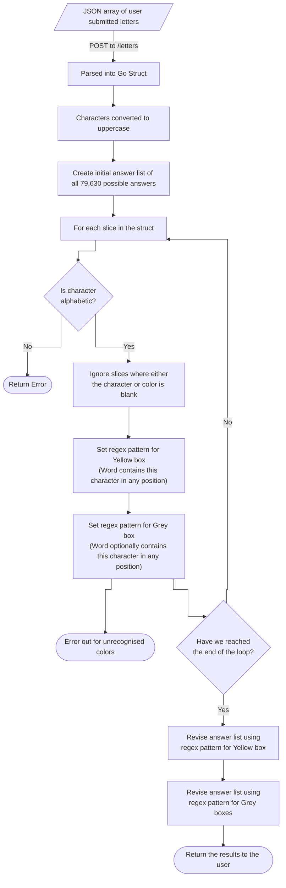

# Spelling Bee Solver
A Go powered web app for solving Spelling Bee puzzles.

## Description
The purpose of this app is to provide a webpage where users (who are stuck on today's Spelling Bee problem) can enter the day's letters and receive a list of all the possible words that fit the criteria, after taking the characters and their colors into account.

The user does this by using the soft-keyboard on the page itself (or physical keyboard on desktop PCs) to enter the characters in the appropriate hexagons, beginning with the central hex.

The characters and their colors will then be computed in order to find all possible solutions to the puzzle.

## Isn't That Cheating Though?
Oh, for _you_ it is, yes, absolutely. I mean, you're using a third-party tool to help you solve the Spelling Bee. You're truly a monster.

... and honestly, it's probably cheating for me too. Spelling Bee is a test of how many words you know (and can spell) that comprise the letters in the hexes. Using a glorified dictionary is almost certainly a capital offence.

In reality though, I don't use this tool very often. Its primary purpose was to act as a project that allowed me to build up my coding skills in Go, HTML, JavaScript, etc.

## Code Logic
Below is a diagram of the logical steps made by the Spelling Bee Solver Go code in order to return a list of possible answers:

## Prerequisites for Local Execution
- Linux
- Go 1.22

## External links
- [NYT Spelling Bee](https://www.nytimes.com/puzzles/spelling-bee)
